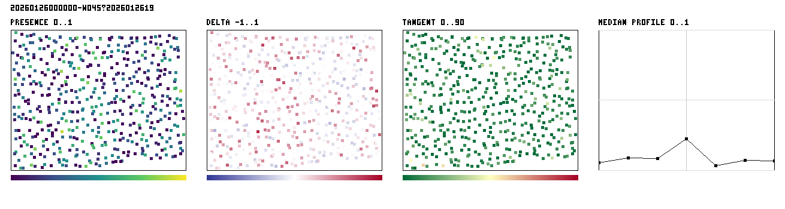
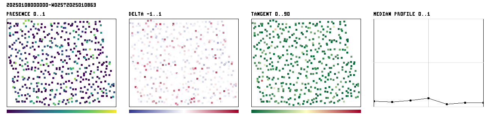

# PHerc0139 fiber-field sanity check — result

**The direction field aligns with mapped sheet geometry, but the preregistered
presence-localization gate does not pass.** This is mixed supporting evidence,
not a validation of fiber tracing or downstream unrolling.

The outcome used all 37 frozen PHerc0139 surface maps and 17,763 frozen sample
locations. The [preregistration](https://github.com/TAUIL-Abd-Elilah/vesuvius-repro/tree/pherc0139-fiber-sanity-prereg-v1)
was public before any prediction value was read. A TLS failure interrupted the
first download before analysis; the failure and transport-only resume rules
were then published in the [immutable amendment](https://github.com/TAUIL-Abd-Elilah/vesuvius-repro/tree/pherc0139-fiber-sanity-transport-amendment-v1).

## Frozen results

| Gate | Frozen threshold | Result | Decision |
| --- | --- | --- | --- |
| Analyzable maps | at least 30 | 37 | pass |
| Maps with positive paired center-minus-control delta | at least 24 | 22 | fail |
| Median map delta | at least 0.020 | 0.00506 | fail |
| Median presence-weighted tangent angle | at most 20° | 6.70° | pass |
| Maps improving at least 5° over the matched baseline | at least 24 | 37 | pass |

Primary decision: `LOCALIZATION_NOT_SUPPORTED`.

Secondary descriptive decision: `TANGENCY_SUPPORTED`.

The median aggregate presence profile at offsets
`[-230.3, -153.5, -76.8, 0, 76.8, 153.5, 230.3] µm` is
`[0.0644, 0.0742, 0.0842, 0.1834, 0.0610, 0.0644, 0.0658]`.
That aggregate center peak does not override the frozen paired map-level gate.

## Interpretation

The predicted directions are consistently close to the mapped sheet tangent
plane. Presence, however, is not reliably more concentrated at the mapped
surface than at the frozen ±76.8, ±153.5, and ±230.3 µm controls.

This benchmark uses surface maps, not human fiber annotations. A generic
sheet-aware direction field can pass the tangency check. It does not measure
fiber continuity, branching, merging, tracing accuracy, unrolling quality, or
ink recovery. The exact checkpoint training overlap with PHerc0139 is also
unknown.

After the run, [issue #1547](https://github.com/ScrollPrize/villa/issues/1547)
identified substantial overlap between `w045` and `w046`. The frozen analysis
keeps both. A clearly labeled post-hoc exclusion of `w046` leaves both decisions
unchanged: 21/36 positive maps, median delta 0.00441, median tangent angle
6.74°, and 36/36 maps improving at least 5° over baseline. The machine-readable
sensitivity record is beside the main result.

## Artifacts

- `result.json`: full decision, provenance, chunk receipts, and per-point data;
  SHA-256 `0bb5eccb21fceb80b4625fc45c9d26ad813913da201770d382bd25980c30a24c`.
- `points.csv`: frozen point-level measurements; SHA-256
  `24b588a5c30f71e54740be25ca9093570d50c7a9dfa0f32f374048c2761f2cd9`.
- `segments.csv`: map-level measurements; SHA-256
  `b1bb4aa2a762f03e8fb6276b5d7a3557deb9cc1ed5d6536b535b941bff9a2312`.
- `panels/`: all 12 preregistered visual panels.
- `OUTCOME_STARTED` and `TRANSPORT_RESUME_STARTED`: immutable execution
  boundary receipts.

The 6.78 GB local prediction mirror is intentionally not committed. Every
downloaded object or declared zero-fill object is accounted for in
`result.json`.
