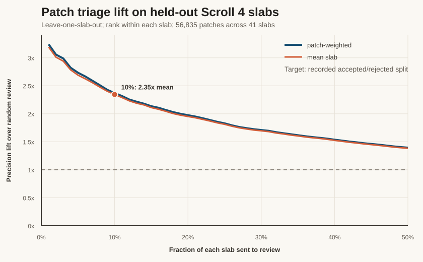

# vesuvius-repro

**Regenerate any published Vesuvius surface prediction from public inputs alone, and score
it against the published artifact.**

Point it at a scroll. It locates a region that actually contains surface, reruns the
official model from the public weights and public CT, blends the logits, and scores the
result against what was published. No private data, no per-scroll hand-wiring — everything
it needs comes from `catalog.json`, so it works for any scroll with a published prediction.

> **Current normalization experiment:** the preregistered causal A/B stopped at its
> baseline sentinel, as designed. PHerc0139 passed; PHerc1203 scored 0.9989617 against a
> frozen 0.999 cutoff. No corrected-arm result was inspected. See the
> [fail-closed result](PHYSICAL_NORMALIZATION_AB_SENTINEL_RESULT.md).

## Try it in 30 seconds (no GPU, no downloads)

```bash
pip install -r requirements.txt
python run_verification.py --scroll PHerc0125 --model m7 --dry-run
```

`--dry-run` resolves the artifact against the live public bucket, probes for a
surface-containing region, and prints the exact inference command it would run:

```
=== PHerc0125  model surface-m7  CT level L0 ===
  probe z=10420 y=4193 x=4193: 26.34% positive
  region 10420:10676,4193:4449,4193:4449  (26.34% positive)
```

Drop `--dry-run` to actually run it and get a Dice score, a disagreeing-voxel count, and a
JSON record in `results/`. That path additionally needs villa's inference module
(`python -m vesuvius.models.run.inference`, used automatically, or point at your own with
`--predict-script`). `--device cpu` works without a CUDA card. `python sweep_all.py` runs
the whole collection unattended and is resumable. `python smoke_test.py` checks a fresh
clone offline.

## What it covers

All **41** published m7 surface artifacts across all **36** scrolls. Each check selects one
surface-containing 256³ region and scores the central 128³ interior. It is deliberately a
**regional spot-check, not a full-volume comparison** — that scope is stated on every
number in this repository.

**Headline: all 41 artifacts have a selected region that can be matched.** Forty match
with test-time augmentation off at Dice 0.9983–1.0000. PHerc. Paris 4's two checked
regions match at 0.9999 with mirroring TTA on.

**They were not produced with the same settings.** PHerc. Paris 4 scores 0.8907 without
TTA and 0.9999 with it. At the time of the audit this setting was absent from artifact
metadata, so the only way to identify it was to test both configurations.

| | TTA off | TTA on |
|---|---|---|
| PHerc0139 (and 34 others) | **0.9997** | 0.8273 |
| PHerc. Paris 4 | 0.8907 | **0.9999** |

The pattern is complementary: TTA breaks PHerc0139 by about as much as its absence broke
PHerc. Paris 4. The finding was not an unreproducible artifact; it was that the collection
used per-scroll inference configurations whose provenance had not reached the outputs.

> **Update, 27 July 2026 — this is now fixed upstream.**
> [villa#1253](https://github.com/ScrollPrize/villa/pull/1253) records `tta` and
> `tta_type` on the inference output, and is merged. In merging it @jrudolph noted the
> team had the setting on their side all along but had never propagated it to the
> metadata, and **backfilled the existing published entries**. The published predictions
> now carry the setting that was missing, retroactively.

> **Earlier versions of this README claimed PHerc. Paris 4 was not reproducible.** That
> was wrong, and it is corrected here and in
> [villa#1250](https://github.com/ScrollPrize/villa/issues/1250). I had eliminated six
> hypotheses by measurement and treated the remaining space as empty; TTA had been
> dropped early because it *hurt* on PHerc0139, and I never revisited that it might vary
> per scroll. Eliminating six candidates is not eliminating all of them.

## Everything else in here

Reproduction was the starting point. The same public inputs support four more measurements,
each with its own runnable script and its own result set under `results/`:

| what | script | result |
|---|---|---|
| **Where the model fails**, over all 892 public labelled volumes | `bench_m7_recall.py` | median recall **90.6%**; 26.5% of volumes below 80% |
| **Why it fails** — missed sheet voxels are *fainter* than found ones, measured within the same volume | `miss_map.py` | 10.3% darker, in 161 of 201 volumes |
| **Whether a fix follows** — a 3-seed controlled augmentation ablation | `ablate_faint_sheet.py` | a clean **negative**, plus a from-scratch reproduction of the effect |
| **Whether the proposed explanation for that negative can hold** | `measure_sheet_contact.py` | only **1.5%** of labelled sheet is in sub-4-voxel contact — too small to be the cause |
| **Predictions over empty CT**, confirming @IyanDopico at collection scale | `pred_over_empty_ct.py`, `phantom_sheet_depth.py` | 30 of 36 scrolls above 10%; 99.69% of it in wholly unscanned blocks |
| **Provenance** — a content hash per public volume, crop-invariant | `hash_public_volumes.py` | 892 hashes; two volumes provably outside the training fingerprint |
| **What that median hides** — the benchmark split by where each volume was located | `overlap_recall_split.py` | the 174 that are Scroll1A crops score **0.777**, the 681 located nowhere score **0.918**; patch-set membership adds nothing (p = 0.80) |

Every figure quoted in this README is regenerated by a script rather than typed
(`summarize_m7_recall.py`, `update_results_table.py`), and claims that died are kept
alongside the ones that survived.

## Patch triage: choose what to review first

`patch_triage.py` ranks tifxyz patches by how likely they are to match Will Stevens'
recorded accepted/rejected split. In leave-one-slab-out evaluation on **56,835 Scroll 4 patches across
41 slabs**, reviewing the top 10% produced **2.345x mean per-slab precision lift** over
random review (95% CI 2.23–2.46); **37/41 slabs** met the preregistered 2.0x floor.
The size-only control achieved 1.03x. This is a review-prioritisation tool, not an
automatic deletion rule.



Point it at one review batch containing `PATCH/x.tif`, `PATCH/y.tif`, and `PATCH/z.tif`.
It reads either an extracted directory or a ZIP archive directly:

```bash
python patch_triage.py rank path/to/tifxyz_patches \
    --out patch_triage_ranking.csv --budget 0.10

python patch_triage.py rank path/to/tifxyz_patches.zip --slab 12 \
    --out patch_triage_ranking.csv --budget 0.10
```

Multiple inputs are accepted, so two archives can be ranked together without extracting or
repacking them. Use `--slab N` (repeatable) when an archive contains more than the 5,000-patch
memory guard; the slab is `floor(z / 250)` and is read from each patch's `meta.json` when present.
On the original two archives, a direct slab-2 run ranked all 543 usable patches. Its nine features,
scores, and ranks exactly matched the extracted-directory run and frozen evaluation cache
(maximum absolute feature difference 0.0); repeated direct-ZIP runs were byte-identical.

The tracked deployment model is loaded from `results/patch_triage_model.json`; no labelled
training cache is needed to rank new patches. The CSV contains a rank and selection flag
plus all nine input features. A JSON sidecar records the model, settings, skipped invalid
patches, and limitations. Ranking is performed separately within each 250-voxel z slab,
because held-out evidence supports within-slab prioritisation and the raw logits are not
calibrated across slabs. The relational pair search is intentionally capped at 5,000
patches per invocation; pass one slab or review batch at a time.

Three limitations matter. The target is **Will Stevens' recorded accepted/rejected split**.
His [public pipeline](https://github.com/WillStevens/scrollreading/tree/589935fa4e8bd1dc46c55c9b082c50ba289843ab/pipeline9)
separately exposes an automatic inconsistency list and annealing/manual exclusion lists, while its
archive converter accepts an arbitrary list. The archives do not record which produced this split,
so it is neither independently validated geometric wrongness nor a documented human decision.
Four small/low-z slabs missed the 2.0x floor.
And the five added features barely changed the result: the original four graph-position
features scored 2.34x at 10%, versus 2.37x pooled for all nine. The useful finding is that
graph position prioritises review—not that a complex feature model is required.

The complete held-out result is in `results/patch_triage.json`; the 1–50% curve is in
`results/patch_triage_curve.json`. With the extracted training caches present, regenerate
the public artifacts with:

```bash
python patch_triage.py evaluate
python patch_triage.py fit-model
python patch_triage.py curve
```

## Results

Each baseline row is one selected region from one artifact on that scroll, scored on the
interior of a 256³ region (64 voxels trimmed per face) and thresholded at the 0.2 in the
artifact name. It is not a whole-volume score.

<!-- RESULTS TABLE: generated by update_results_table.py, do not hand-edit -->

| scroll | CT level | Dice | disagreeing voxels | verdict |
|---|---|---|---|---|
| PHerc0500P2 | L2 | **1.0000** | **0** | regional match (exact) |
| PHerc1203 | L2 | 0.9999 | 81 (0.004%) | regional match |
| PHerc1447 | L0 | 0.9999 | 119 (0.006%) | regional match |
| PHerc0009B | L2 | 0.9998 | 169 (0.008%) | regional match |
| PHerc0846B | L0 | 0.9998 | 197 (0.009%) | regional match |
| PHerc0343P | L2 | 0.9998 | 105 (0.005%) | regional match |
| PHercMAN5 | L2 | 0.9998 | 115 (0.005%) | regional match |
| PHerc0332 | L2 | 0.9998 | 134 (0.006%) | regional match |
| PHercMANB | L2 | 0.9998 | 240 (0.011%) | regional match |
| PHercMANBp | L2 | 0.9997 | 146 (0.007%) | regional match |
| PHerc0125 | L0 | 0.9997 | 254 (0.012%) | regional match |
| PHerc0175A | L0 | 0.9997 | 254 (0.012%) | regional match |
| PHerc0846A | L2 | 0.9997 | 281 (0.013%) | regional match |
| PHerc0139 | L0 | 0.9997 | 266 (0.013%) | regional match |
| PHerc1218 | L0 | 0.9997 | 347 (0.017%) | regional match |
| PHerc0358 | L0 | 0.9997 | 315 (0.015%) | regional match |
| PHerc0841 | L2 | 0.9996 | 404 (0.019%) | regional match |
| PHerc0343 | L0 | 0.9996 | 406 (0.019%) | regional match |
| PHerc0211 | L0 | 0.9996 | 384 (0.018%) | regional match |
| PHerc0306B | L0 | 0.9995 | 446 (0.021%) | regional match |
| PHerc1545 | L0 | 0.9995 | 696 (0.033%) | regional match |
| PHerc1451 | L2 | 0.9995 | 455 (0.022%) | regional match |
| PHerc0800 | L0 | 0.9994 | 642 (0.031%) | regional match |
| PHerc1299 | L2 | 0.9994 | 646 (0.031%) | regional match |
| PHerc0826 | L0 | 0.9993 | 779 (0.037%) | regional match |
| PHerc0490B | L0 | 0.9993 | 856 (0.041%) | regional match |
| PHerc0483A | L0 | 0.9991 | 833 (0.040%) | regional match |
| PHerc0257 | L0 | 0.9990 | 1,080 (0.051%) | regional match |
| PHerc0268 | L0 | 0.9990 | 1,492 (0.071%) | regional match |
| PHerc0191 | L0 | 0.9989 | 1,267 (0.060%) | regional match |
| PHerc0175B | L0 | 0.9986 | 1,708 (0.081%) | regional match |
| PHerc0813 | L0 | 0.9986 | 1,695 (0.081%) | regional match |
| PHerc0490A | L0 | 0.9985 | 1,615 (0.077%) | regional match |
| PHerc0483B | L0 | 0.9985 | 2,329 (0.111%) | regional match |
| PHerc0814 | L2 | 0.9983 | 2,918 (0.139%) | regional match |
| **PHercParis4** | **L2** | **0.8907** | **108,044 (5.15%)** | **matches with TTA (0.9999)** |

**35 TTA-off regional checks match** — 22 at CT level 0 and 13 at level 2 — at Dice 0.9983–1.0000. In every one, 100% of the differing voxels lie within 0.01 of the threshold, consistent with numerical boundary residue.

**PHercParis4 requires a different recorded configuration.** Detail below.

<!-- END RESULTS TABLE -->

Every row has its raw regional report in [`results/`](results), and the table above is generated
from those files by `update_results_table.py` rather than maintained by hand — it drifted
out of sync with the evidence twice while it was hand-written. `sweep_all.py` ran the
whole collection unattended, one 256³ region per scroll, and every one of the 36 runs
completed.

**The PHerc. Paris 4 row above is its TTA-off score, kept deliberately.** With TTA on it
reproduces at 0.9999 on both regions — see below. The table is generated from the default
(TTA-off) runs so it answers one question consistently: *does this scroll reproduce under
the settings that work for the rest of the collection?* For PHerc. Paris 4 the answer is
no, and that is the whole point. Its TTA runs live in
[`results/variants/`](results/variants), outside the generated table.

### Follow-up: the five additional artifacts

Five scrolls carry a second m7 artifact at L0. These were outside the original
one-artifact-per-scroll baseline, so each received the same selected-256³/central-128³
regional check. All five match with TTA off:

| scroll | additional artifact | Dice | disagreeing voxels |
|---|---|---|---|
| PHerc0500P2 | L0 | **1.0000** | **0** |
| PHerc0814 | L0 | 0.9991 | 1,247 (0.059%) |
| PHerc0841 | L0 | 0.9984 | 1,785 (0.085%) |
| PHerc0846A | L0 | 0.9995 | 619 (0.030%) |
| PHerc1203 | L0 | 0.9996 | 421 (0.020%) |

Together with the baseline and PHerc. Paris 4's recorded TTA run, this gives one matching
regional check for **all 41 catalogued m7 artifacts across all 36 scrolls**. Every nonzero
difference in the five follow-ups is within 0.01 of the threshold. The raw reports are in
[`results/variants/`](results/variants); this is still regional evidence, not a statement
about every voxel in an artifact.

One region of PHerc0846A (z 2460, 36% positive) is worth a note: there the model produced
an unusually flat output — logits spanning [-1.9, 6.5] against [-4.3, 18.3] on a healthy
region, so 97% of voxels cleared the 0.2 threshold. A second region of the *same scroll*
reproduced at 0.9997, so this is a property of that region, not a reproduction failure.
It is recorded here rather than dropped because a region where the published model loses
confidence is worth someone's attention.

### The PHerc. Paris 4 exception — solved: it was predicted with TTA

Under the collection's default settings, two independent regions fail. These were each
ruled out by measurement:

| hypothesis | test | result |
|---|---|---|
| wrong source volume | shape match across all 5 of its volumes and their pyramids | only `20260411134726` L2 matches the prediction; ruled out |
| spatial offset | Dice over a ±2 voxel shift search in all 3 axes | peaks at **(0,0,0)**; ruled out |
| step size | rerun at 0.5 / 0.75 / 1.0 | 0.8907 / 0.8467 / 0.7483 — the default is best; ruled out |
| calibration or precision | Dice over every threshold 0.01–0.95 | headroom **+0.0005**; ruled out |
| the region | a second, independent region | also fails; ruled out |
| CT pyramid construction | is published L2 `round(mean(L1))` or a direct 4x of L0? | it is the standard successive 2x mean+round, same as the reproducing L2 scrolls; ruled out |
| model fold | which checkpoints exist | only `fold_0/checkpoint_best.pth`, and all 35 others reproduce with it; ruled out |
| **mirroring TTA** | **rerun both regions with TTA on** | **0.9999 and 0.9999 — this is the answer** |

```bash
python run_verification.py --scroll PHercParis4 --model m7 --level 2 --tta \
    --bbox 6600:6856,3200:3456,4032:4288 --tag tta
```

The converse holds, which is what makes it conclusive rather than coincidental: running
PHerc0139 **with** TTA drops it from 0.9997 to **0.8273** — it breaks by about as much as
PHerc. Paris 4 broke without it. One setting, two scrolls, opposite directions.

These regional checks show that all 36 selected regions can be regenerated, but **not
under a single configuration**. At audit time their `.zattrs` carried only boilerplate
`multiscales`, so identifying PHerc. Paris 4's TTA setting required a search. That
provenance gap is now fixed: [villa#1253](https://github.com/ScrollPrize/villa/pull/1253)
records TTA on new outputs and maintainers backfilled the existing published entries.

Nothing here says any published prediction is wrong or proves a whole artifact is
reproducible. It establishes regional agreement on one selected region per scroll and
documents the per-artifact configuration needed to repeat those checks.

Tracked upstream at
[ScrollPrize/villa#1250](https://github.com/ScrollPrize/villa/issues/1250) — filed
originally as a non-reproduction, then corrected there once TTA turned out to explain it.

## The catalogue

`catalog_predictions.py` walks the public bucket and resolves, for every scroll, which
published predictions exist, which CT volume each names, and which pyramid level each
actually sits on (by shape, not by trusting the filename).

```
scrolls scanned                    : 45
published surface predictions      : 42   across 36 scrolls
declared CT level matches the grid : 42   (L0=28, L2=14)
declared level WRONG               : 0
model families                     : surface-m7 (run 20260413222639) x41
                                     surface-recto-2um-ps256 (run 20260413141734) x1
public CT but no prediction        :  3   (PHerc0172, PHerc1667, PHercParis3)
no CT at all - photographs only    :  6
```

Two things worth knowing that fall out of it:

* **The `L<k>` token in the filenames is accurate on all 42.** The ~9 µm scans are
  predicted at level 0 and the ~2.4 µm scans at level 2, i.e. the model has one working
  resolution (~9.6 µm) and the level is chosen to hit it. You can rely on the token.
* **Three scrolls have public CT but no published surface prediction**: PHerc0172,
  PHerc1667 and PHercParis3. Six further prefixes carry *no CT at all* — only
  photographs (PHerc1667Cr1Fr3, PHerc51Cr4Fr8, PHercParis1Fr34, PHercParis1Fr39,
  PHercParis2Fr143, PHercParis2Fr47). An earlier version of this README counted all
  nine as "public CT but no prediction", which overstated what is missing; the
  catalogue now distinguishes `no_prediction` from `no_ct`.
* **Five scrolls are predicted twice**, once from a 9 µm scan and once from a 2.4 µm scan:
  PHerc0500P2, PHerc0814, PHerc0841, PHerc0846A, PHerc1203.

## Scrolls with no published prediction

Verification has a natural other half: if the model is public and the CT is public, the
scrolls the project *hasn't* covered can be predicted too. Three have public CT and no
published surface prediction — `survey_uncovered.py` finds them and checks whether any
pyramid level of any of their volumes lands on the model's ~9.6 µm working resolution.

| scroll | volume | level | µm | positive | mean confidence |
|---|---|---|---|---|---|
| PHercParis3 | 20260427095331 | 2 | 9.600 | 22.4% | 0.803 |
| PHerc1667   | 20251217075048 | 2 | 9.596 | 11.1% | 0.938 |
| PHerc0172   | 20241024131838 | 0 | 7.910 |  8.2% | 0.968 |

**These are new artifacts, not reproductions — there is nothing to score against, so no
Dice is claimable for them and none is quoted.** What is checkable is whether the model
is operating in its normal regime, and that judgement is calibrated rather than asserted:
`calibrate_regime.py` measures the same statistics on regions whose status is already
known. Mean confidence separates them cleanly — reproduced regions run 0.231–0.944, the
one known-degenerate region sits at 0.032. All three above land inside the healthy band.

Two caveats stated rather than buried. **PHerc0172's CT is 7.91 µm, 18% off the model's
working resolution** — the other two are within 0.05% of it — so its output deserves
less weight. And PHerc1667 and PHerc0172 have positive fractions below the 19–77% seen
in published regions; that is flagged in their JSON, not treated as failure.

Logit span, incidentally, does *not* indicate health, though it looks like it should:
PHerc0500P2 reproduced **exactly** (Dice 1.0000) with a span of 6.2, narrower than the
known-degenerate region's 8.3.

```bash
python survey_uncovered.py --out uncovered.json
python predict_uncovered.py --scroll PHercParis3
python calibrate_regime.py          # the evidence behind the healthy band
```

## The other question: what does the published model MISS?

Everything above asks whether the predictions are right *where they exist*. The inverse
matters more for reading, because a missed sheet is text nobody recovers.

The public Kaggle surface-detection set is ground truth for exactly this. The published m7
path was run over **all 892 labelled volumes** and scored against the labels — 855 have
labelled sheet in the scored interior and 37 do not. There are no failures: the five
transient CUDA errors in the earlier 868-volume run were retried and all five completed.

Regenerate every figure below with `summarize_m7_recall.py` rather than reading them off
this page.

| recall — labelled sheet the model finds | |
|---|---|
| median | **90.6%** |
| mean | 84.3% |
| 5th percentile | **55.0%** |
| below 80% recall | **26.5% of volumes** |
| below 70% | 14.6% |
| below 50% | 3.5% |
| **whole labelled sheets barely recovered** | **43 of 3,517** components, across 39 volumes |

**It is not a thresholding artifact.** Dropping the cut from the published 0.2 all the way
to 0.05 moves median recall only from 90.6% to 96.2%; at 0.7 it falls to 78.5%. The signal
mostly is not there to be recovered by re-thresholding.

**Recall is very uneven across the set, and index position is not a proxy for difficulty.**
Median recall by index block runs 90.1 / 81.6 / 79.9 / 91.8 / 93.3 / 92.8 / 92.3 / 91.9 /
77.0 for blocks of 100. The 24 volumes found late (893–916) have median recall 79.1% against
90.8% for the rest, which looks like a train/test gap and **is not one**: they sit inside a
broader low-recall region that begins around index 800 and was already in the original run,
there is no trend within 1–892 (Spearman ρ = 0.03, p = 0.40), and several other contiguous
24-volume blocks score lower still — 845–873 medians 57.3%. Comparing any block against the
global mixture will look significant; that comparison is recorded here because it was run
and it failed, not because it shows anything.

### Three limits, and the first one matters most

**These public labels appear to overlap heavily with m7's training set, but exact identity
is not proven.** The published model's `dataset_fingerprint.json` lists 786 training cases,
but not their public sample identifiers. Comparing the *exact* crop-to-nonzero shape of
every public volume against that list (`hash_public_volumes.py --fingerprint`) gives:

| crop-to-nonzero shape | m7 training | this public set | surplus |
|---|---|---|---|
| (320, 314, 314) | 737 | 837 | +100 |
| (256, 250, 250) | 43 | 47 | +4 |
| (320, 297, 314) | 1 | 1 | 0 |
| (384, 177, 378) | 1 | 1 | 0 |
| (256, 170, 250) | 1 | 1 | 0 |
| (256, 216, 250) | 1 | 1 | 0 |
| (256, 139, 250) | 1 | 1 | 0 |
| (256, 134, 250) | 1 | 1 | 0 |
| (296, 314, 314) | **0** | **1** | +1 |
| (320, 227, 314) | **0** | **1** | +1 |
| total | **786** | **892** | **+106** |

Every shape m7 trained on occurs in the public set at least as often as m7 needs it,
including six singleton shapes that match one-for-one. That is strong evidence of
substantial overlap — **not proof** that the 786 are a subset of these 892, because a shape
is not an identifier. **These numbers therefore cannot be treated as held-out.** Nor can the
106-volume difference be called a held-out set: the count says how many volumes *could* be
outside the training list, not which.

**Two of them can be named, though.** `sample_00853` (296, 314, 314) and `sample_00854`
(320, 227, 314) carry crop shapes that appear nowhere in the fingerprint, so no training
case had their geometry. Under the one assumption this rests on — that nnUNet's
crop-to-nonzero matches the one computed here, which the 837 exact (320, 314, 314) matches
support — those two volumes were **not** in m7's training set. That is 2 named of a possible
106, not a held-out set, but it is the first part of this question answered rather than
bounded.

**⚠ The public set is 892 volumes, not 868.** An earlier version of this README said 868 and
bucketed by largest dimension only. The indices run 1–916 with 24 genuine 404 gaps inside
them; the gaps were verified individually but the *upper bound* never was, and 893–916 were
missed. The benchmark numbers above have since been recomputed over all 892.

**The third label class is `ignore`, and it is the majority of a typical volume (~59%).**
It has to be excluded from scoring. Recall is unaffected, since it only ever looks at
class-1 voxels — but an earlier version of this benchmark folded `ignore` into background,
which understated precision by roughly a factor of two.

Recomputed with `ignore` excluded, on a 58-volume subset (**not** the full 855 — the sample
sizes differ and are labelled deliberately):

| | invalid, ignore as background | **corrected** |
|---|---|---|
| precision | median 34.7% | **median 76.8%** (34.4–90.3%) |
| recall | 90.8% | 91.5% — unchanged, as expected |

**About 45% of the model's predictions land in the `ignore` region**, which is why the original
figure was so far off: nearly half of what it predicts was being scored as error when it is
simply unscoreable.

So the earlier claim that m7 "predicts a band several times thicker than the labelled
sheet" **was an artifact of this scoring bug, not a property of the model** — and it is
withdrawn rather than restated. At 91.5% recall and 77% precision within the scored region
it is a well-behaved model. The `ignore` class also undermines the "best achievable Dice
0.4391" ceiling reported earlier from a single sample, which was computed the same way.

**Labels exist only where somebody already segmented**, so this measures recall *where
labels exist* and says nothing about the compressed or highly curved regions of
[villa#191](https://github.com/ScrollPrize/villa/issues/191) — the catch-22 described in
[villa#193](https://github.com/ScrollPrize/villa/issues/193).

### Where it misses: on the faint parts of the sheet

The rate alone is not useful; an improver needs to know what is hard. Two analyses, and the
first one failed.

**Volume-level properties have weak predictive power in this analysis.** Thickness,
inter-sheet spacing, CT contrast, fragmentation and flatness, measured for the 868 volumes scored at the time,
jointly explain **9.9% in-sample**. Random 10-fold validation explains about **3.7–6.0%**,
depending on the split seed, and no source-group identifiers were available to prevent
related samples crossing folds. The fitted model spans 77–92% predicted recall against an
actual 55–97%, so these features alone do not reliably distinguish easy and hard volumes.

**Comparing within each volume does find it.** Missed sheet voxels against found sheet
voxels in the *same* volume, so each volume is its own control:

| property at missed vs found voxels | result |
|---|---|
| **CT intensity** | **missed are 10.3% darker** (median 96 vs 107) |
| consistency | **161 of 201 volumes (80.1%)**, sign test **p = 2×10⁻¹⁸** |
| local CT texture | weakly lower (61%) |
| local sheet thickness | no difference |
| component size | no difference |

The association is severity-graded: the worse a volume is, the darker its missed regions
are relative to what was found. This supports an intensity-related hypothesis but does not
establish that intensity causes the misses:

| volumes by recall | median effect | darker in |
|---|---|---|
| recall < 70% | −0.708 σ | **90%** |
| 70–90% | −0.475 σ | 84% |
| > 90% | −0.163 σ | 71% |

**Within the measured labelled regions, missed sheet voxels are generally fainter than
found voxels.** That points to intensity-targeted augmentation or normalisation as a
testable intervention, and it is consistent with
[villa#191](https://github.com/ScrollPrize/villa/issues/191)'s "compressed or highly curved
regions", where the papyrus is faintest.

Because exact training membership and source grouping are unavailable, this result should
be read as an association within the public labelled set, not as a held-out generalisation
claim or a causal conclusion.

```bash
python bench_m7_recall.py --n 900     # recall + the paired local comparison
python miss_map.py --n 900            # volume-level descriptors (the negative result)
```

### So we tested the fix it implies — and it does not work

A measurement that predicts an intervention is worth little until someone runs the
intervention. `ablate_faint_sheet.py` is that controlled test: two arms, three seeds each,
100 epochs on 96 memory-mapped public volumes, identical in architecture, split, schedule
and head. The only difference is the augmentation — flips alone, against flips plus a local
intensity attenuation that manufactures faint sheet on demand.

**The headline metric is not Dice. It is recall stratified by ground-truth sheet
brightness** (per-window terciles of GT sheet voxel intensity). A fix for this failure mode
must show up *concentrated in the dark tercile*; a uniform gain would only mean generic
regularisation, and a bright-only gain would contradict the hypothesis outright. That
metric is the reusable part of this experiment, and it is what the script reports.

| | baseline (flips) | faint | delta |
|---|---|---|---|
| sheet Dice | 0.1560 ±0.0016 | 0.1198 ±0.0058 | −0.0362 |
| **recall, DARK tercile** | **0.3233 ±0.0312** | **0.3077 ±0.0288** | **−0.0156 — not demonstrated** |
| recall, mid | 0.5777 ±0.0337 | 0.4552 ±0.0526 | −0.1225 |
| recall, bright | 0.7474 ±0.0425 | 0.3547 ±0.1101 | −0.3927 |

**Two results, and the second is the durable one.**

1. **The intervention failed.** Dark-tercile recall did not move — −0.016 against a
   between-seed spread of 0.03 — while everything else got worse. The brightness gap does
   close, from 2.3× to 1.2×, but it closes *downward*: bright recall falls to dark's level
   rather than dark rising. That flattening is descriptive only and should not be read as
   progress; it is consistent with the arm simply being worse, with dark already near a
   floor and less room to fall.

2. **The baseline reproduces the phenomenon from scratch.** A model trained from random
   init with flips only recalls **0.32 of the darkest third** of ground-truth sheet voxels
   against **0.75 of the brightest** — a **2.3× gap present in every one of three seeds**
   (per-seed ratios 2.62 / 2.28 / 2.08). So the faint-sheet failure is not an m7 quirk. It
   is what this data and ordinary augmentation produce, which turns the observational
   finding above into a controlled reproduction.

**Scope, which travels with the result.** One augmentation configuration was tested
(`faint_prob 0.5`, `faint_max 0.45`, Gaussian mask σ 2.5). This rules out that
configuration, not intensity augmentation in general. The baseline is also weak in absolute
terms (sheet Dice 0.156, 96 of 892 volumes, 100 epochs), so a null here can be a floor
effect. `--compare` refuses to call any difference smaller than the across-seed spread.

The attenuation mask is deliberately Gaussian-blurred before it modulates intensity.
Attenuating the raw label mask would stamp an intensity edge along the label boundary, and
the model could then locate sheets by that artifact — the arm would "win" for a reason that
does not transfer. That is the most likely way this experiment could have produced a false
positive, and it is why the blur is not a tunable.

```bash
python ablate_faint_sheet.py --arm baseline --seed 0    # ~45 min on an RTX 3090
python ablate_faint_sheet.py --arm faint --seed 0
python ablate_faint_sheet.py --compare                  # verdicts vs across-seed spread
```

Results for all six runs are in `results/ablation_faint/`.

#### The proposed explanation for the negative does not survive measurement either

On [villa#191](https://github.com/ScrollPrize/villa/issues/191) @Jinhojeong proposed a
mechanism: the attenuation is geometry-blind, so it also darkens *contacts* — places where
two sheets sit close enough that intensity has already stopped separating them, making those
cases unresolvable by construction. They report models merge sheets at sub-4-voxel contacts.
That predicts a gated fix: attenuate only where the sheet is not in contact.

`measure_sheet_contact.py` checks whether such a gate could bite, before spending GPU time
on it. A morphological closing fills any gap thinner than 2r voxels; what the closing adds
was a thin gap, and the sheet bordering it is the contact. Over 40 random 128³ crops:

| gap closed | mean fraction of sheet in contact |
|---|---|
| 2 vox | 0.003 |
| **4 vox** | **0.015** |
| 6 vox | 0.045 |
| 10 vox | 0.132 |
| 16 vox | 0.353 |

**At the reported sub-4-voxel scale, 1.5% of labelled sheet qualifies.** A gated arm would
still attenuate ~98% of the same voxels, so it would be a near-duplicate of the ungated one
— and 1.5% of the population cannot explain bright recall falling 0.75 → 0.35. The radius is
**swept, not tuned**: it could be inflated to 16–24 voxels to make the gate bite, but that is
not contact in any physical sense, and picking a threshold because it yields a workable
number is the failure this repository has a rule against.

The remaining hypothesis is a dose/statistics one rather than geometry: attenuating up to
45% on half of all crops shifts the whole training intensity distribution darker, so the
model recalibrates and loses the bright regime. That predicts holding the mean fixed and
widening the variance instead — untested.

Both scripts need the public labelled volumes under `data/kaggle/`; they exit with a clear
message rather than a traceback if the data is not present.

#### ⚠ The stratified-recall metric has a failure mode. Here it is, and here is the guard

A third arm, `faintloss`, attacks the same measurement from the optimisation side instead of
the data side: leave the input alone and weight the cross-entropy so faint sheet voxels carry
more gradient (`1 + alpha * (1 - intensity)` where the label is sheet, `alpha = 2`). The
weight is a function of input intensity, available at test time, so it is a reweighting and
not a label leak, and nothing changes at inference. `alpha = 0` reproduces standard weighted
CE exactly, so the arms are comparable.

The raw result looks like a decisive confirmation of the faint-sheet hypothesis:

| | baseline | faintloss | delta |
|---|---|---|---|
| recall DARK tercile | 0.3233 ±0.0312 | **0.8065 ±0.0420** | **+0.483** |
| recall mid | 0.5777 | 0.9361 | +0.358 |
| recall bright | 0.7474 | 0.9689 | +0.222 |
| **sheet Dice** | **0.1560 ±0.0016** | **0.1265 ±0.0022** | **−0.029** |

**It is not a fix. It is a bias shift, and raw stratified recall cannot tell the difference.**
Two tells. Sheet Dice fell and implied precision fell from ~0.091 to ~0.068 — the model
learned to predict sheet more liberally everywhere and bought recall with precision. And
normalising each tercile's gain by its available headroom `(1 - baseline)` gives **dark
0.714, mid 0.849, bright 0.877** — the gain is *least* selective for dark sheet, the opposite
of the hypothesis.

The general point, which applies to any stratified metric: **a uniform bias shift always
produces the largest raw gain in the stratum with the lowest baseline.** For a metric built
to detect under-performance on faint sheet, that is precisely the signature the hypothesis
predicts, so the metric rewards the artefact. `--compare` therefore now reports
headroom-normalised gain by default and warns explicitly when recall rises while Dice falls.
It also compares *every* arm against baseline; an earlier version was hardcoded to two and
silently ignored this third one.

The bar was fixed in advance in `PREREGISTER_faintloss.md`, written before the arm ran.
`faintloss` passes the dark-gain and bright-recall conditions and **fails the Dice
condition**, so it is recorded as a trade rather than an improvement, which is what that
document says to do.

## Predictions that extend past the scan — confirming @IyanDopico at collection scale

Some published surface predictions mark sheet where the masked CT is identically zero.
**This is [@IyanDopico](https://github.com/IyanDopico)'s finding, not mine** —
[vesuvius-sheet-tools](https://github.com/IyanDopico/vesuvius-sheet-tools) documented it on
12 July and already gates on `ct > 0` to remove what they called "chunk-aligned false
positives floating in air outside the scroll". I filed
[villa#1254](https://github.com/ScrollPrize/villa/issues/1254) two weeks later without
checking whether the community already knew, and corrected that on the issue.

What the measurement adds is scale and shape. Sampling 30 random 64³ blocks per scroll
across all 36, against the CT at each prediction's own declared level:

- **30 of 36** scrolls have more than 10% of their predicted sheet on identically-zero CT.
  Median 38%, worst 92.1%, 39.7% pooled over every sampled voxel.
- Only **PHerc0332** is exactly clean; three more sit below 0.01%.
- Decomposed by distance to the nearest scanned voxel: **99.69%** of that volume sits in
  blocks with *no scan data at all*, not at sheet boundaries — which independently supports
  the "chunk-aligned" description. Where scan and prediction coexist, 59.3% of the
  disagreement is within 2 voxels.

Per-scroll figures are noisy — ±20–50 pp — and an earlier version of the issue had three
rows wrong because it mixed 20-block and 30-block samples in one table. The collection-level
pattern is the robust part.

```bash
python pred_over_empty_ct.py --scrolls PHerc0343P PHerc0332 --n-blocks 30
python phantom_sheet_depth.py --scrolls PHerc0343P --n-blocks 12   # fringe vs unscanned
```

## How the measurements work

Two things do most of the work, and both are designed to *bound* explanations rather than
suggest them.

**A sweep over every threshold.** Re-thresholding is strictly more generous than any global
precision or calibration change, so the best Dice over all thresholds is an upper bound on
what fp16 autocast, float16 storage or a threshold ambiguity could ever buy. On PHerc0139
before the grid was fixed, that bound was 0.8019 against 0.8001 achieved — which killed the
"it's fp16" hypothesis analytically, before spending any GPU time on it.

**Where the disagreement sits relative to the threshold.** A voxel far from the decision
boundary cannot be flipped by a small perturbation, so the share of disagreement lying far
away is a floor on what has to be explained structurally.

`diagnose_structure.py` adds fingerprints that separate the remaining structural causes:
disagreement against position modulo the patch stride (a grid or blending artifact is
phase-locked), against distance from the region faces (an edge effect rises at the faces),
and against CT intensity (an input difference tracks the data).

## Usage

```bash
# install the analysis and scoring dependencies
python -m pip install -r requirements.txt

# offline integrity check (also suitable for a clean clone)
python smoke_test.py

# 1. catalogue what is published and what level it lives on
python catalog_predictions.py --out catalog.json

# 2. verify one scroll end to end: pick a region, predict, blend, score
python run_verification.py --scroll PHerc0125 --model m7

# inspect the predictor command and selected region without launching inference
python run_verification.py --scroll PHerc0125 --model m7 --dry-run

# scrolls predicted twice need the level
python run_verification.py --scroll PHerc1203 --model m7 --level 2

# 3. score a blended store you already have
python verify_region.py --scroll PHerc0139 --model m7 \
    --ours outputs/repro/merged.zarr --bbox 8000:8256,3200:3456,3200:3456

# 4. if a region did not match, fingerprint the difference
python diagnose_structure.py --scroll PHercParis4 \
    --ours outputs/paris4/merged.zarr --bbox 6600:6856,3200:3456,4032:4288
```

Only public data is touched, anonymously — no credentials and no terms acceptance. The
catalogue step reads metadata only, a few KB per scroll.

## Requirements

The offline checks and analysis scripts use the packages pinned broadly in
`requirements.txt`. End-to-end inference additionally requires the current
[`ScrollPrize/villa`](https://github.com/ScrollPrize/villa) model stack. By default the
runner uses the current interpreter and `hf://scrollprize/surface_m7_nnunet`; portable
overrides are available through `--python`, `--model-path`, and `--predict-script`, or the
`VESUVIUS_PYTHON`, `VESUVIUS_MODEL_PATH`, and `VESUVIUS_PREDICT_SCRIPT` environment
variables. `VESUVIUS_INK_MODEL_PATH` supplies the optional ink model used by
`predict_ink.py`.

These upstream fixes are relevant to region-scoped inference:

| PR | what it fixes |
|---|---|
| [#1247](https://github.com/ScrollPrize/villa/pull/1247) | `--bbox` took its patch grid from the region instead of the volume, so an ROI run silently disagreed with a full run (Dice 0.80 rather than 0.9997) |
| [#1238](https://github.com/ScrollPrize/villa/pull/1238) | `predict` could not create output stores under the pinned zarr |
| [#1239](https://github.com/ScrollPrize/villa/pull/1239) | `--device cpu` |
| [#1240](https://github.com/ScrollPrize/villa/pull/1240) | `Volume.meta()` crash on `--verbose` |
| [#1244](https://github.com/ScrollPrize/villa/pull/1244) | one dropped connection discarded a whole run; it recovered 23 transient failures during the runs behind this table |
| [#1241](https://github.com/ScrollPrize/villa/pull/1241) | `--bbox` itself (merged) |

## Licence

MIT.
