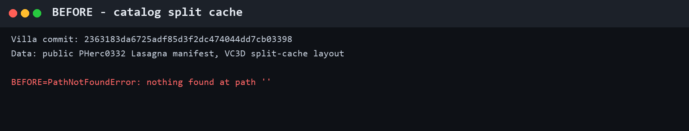
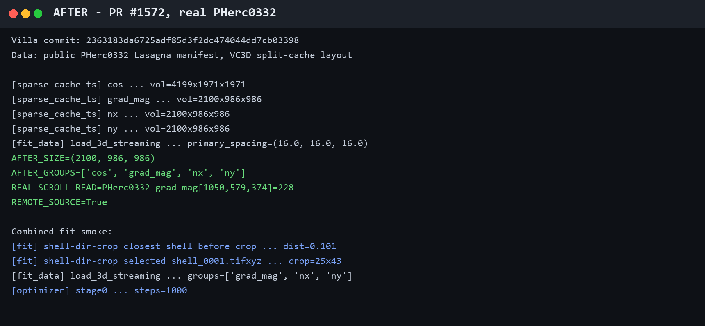

# Villa #1540 real-data replay

Tested Villa commit: `2363183da6725adf85d3f2dc474044dd7cb03398`

Input: the unchanged public PHerc0332 Lasagna manifest at:

`PHerc0332/representations/predictions/lasagna/20251211183505-lasagna-20260419180421-L2/PHerc0332-20251211183505-lasagna-20260724.lasagna.json`

The local fixture reproduced VC3D's catalog layout: the manifest and
`lasagna-remote.json` were adjacent, Zarr metadata was under
`.lasagna-zarr-metadata`, and the visible group directories contained no
metadata.

- Before: the old manifest-sibling `zarr.open` fails with `PathNotFoundError`.
- After: all four groups open from the authoritative public artifact and a real
  PHerc0332 voxel reads as `grad_mag[1050,579,374] = 228`.
- Combined fit smoke: `--init-shell-dir` selected a shell, constructed a 25x43
  mesh, opened `grad_mag`, `nx`, and `ny`, and reached stage-0 prefetch.

These images are rendered from the exact terminal transcript:

The full 2,500-step run could not execute on this Windows host because the
existing sparse CUDA extension needs Ninja and `nvcc`, neither of which is
installed. This is a host prerequisite, not a failure in the PR. The reporter
of Villa #1540 offered an independent replay on the working CUDA rig used for
the original end-to-end run.

The initialization shell is synthetic geometry through the real material point
`(5984, 9264, 16800)`; all sampled optimization channels are the public real
PHerc0332 predictions. This evidence does not claim surface quality.
