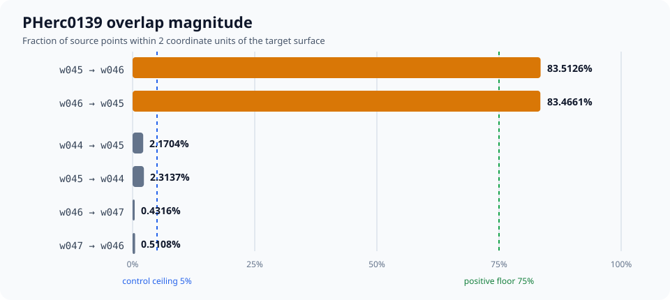

# Villa #1547 overlap-magnitude replay

Tested Villa commit: `ee5aa5bc84faaff14701b3ba4c8e8b27540cac76`

The new optional `vc_seg_add_overlap --report-json` output was replayed on the
four original PHerc0139 TIFXYZ windows from
[`nerln/vesuvius-ladder@7ae4dff`](https://github.com/nerln/vesuvius-ladder/tree/7ae4dffe5ffe91c508c26699543320b8e51f6b03/check_data).
The thresholds were [posted publicly](https://github.com/ScrollPrize/villa/issues/1547#issuecomment-5386343015)
before the run and are copied in [PREREGISTRATION.md](PREREGISTRATION.md).

## Result

| directed pair | matched / queried | coverage |
|---|---:|---:|
| w045 -> w046 | 91,716 / 109,823 | **83.5126%** |
| w046 -> w045 | 91,665 / 109,823 | **83.4661%** |
| w044 -> w045 control | 2,389 / 110,074 | 2.1704% |
| w045 -> w044 control | 2,541 / 109,823 | 2.3137% |
| w046 -> w047 control | 474 / 109,823 | 0.4316% |
| w047 -> w046 control | 554 / 108,461 | 0.5108% |

All preregistered gates passed. The smaller w045/w046 result is **36.07x**
the largest adjacent control. This is point-to-triangle coverage within 2
coordinate units, not the issue's separate exact-vertex-duplication metric.
It is a diagnostic signal, not an automatic deletion verdict.



The old boolean output marks all six undirected pairs as overlapping because
even a few nearby points are enough. The new magnitude report makes the
w045/w046 pair stand out instead of looking like an ordinary overlap.

## Integrity checks

- One-worker and four-worker reports are byte-identical:
  `6a5b6ef6217629452b2717682fa475184e2c9641c2b3011e4813f3d67bc5c65d`.
- For every window, `overlapping.json` is byte-identical between the baseline,
  one-worker report, and four-worker report runs. The three copies are under
  `legacy/`.
- The implementation's focused C++ tests pass in Villa's official Linux build
  image, including synthetic geometry, legacy-output equivalence, worker
  determinism, alias safety, and invalid-count checks.
- [INPUT_SHA256SUMS.txt](INPUT_SHA256SUMS.txt) pins all 16 source files before
  Villa's automatic TIFF mmap-layout repair.

Run the artifact checks with:

```bash
python evidence/villa-1547/verify_report.py
```

The real-data command was:

```bash
vc_seg_add_overlap \
  --target /evidence/run-report-w1 \
  --source /evidence/run-report-w1 \
  --workers 1 \
  --point-stride 1 \
  --report-json /evidence/report-workers-1.json
```

The same command with `--workers 4` produced the second frozen report.
